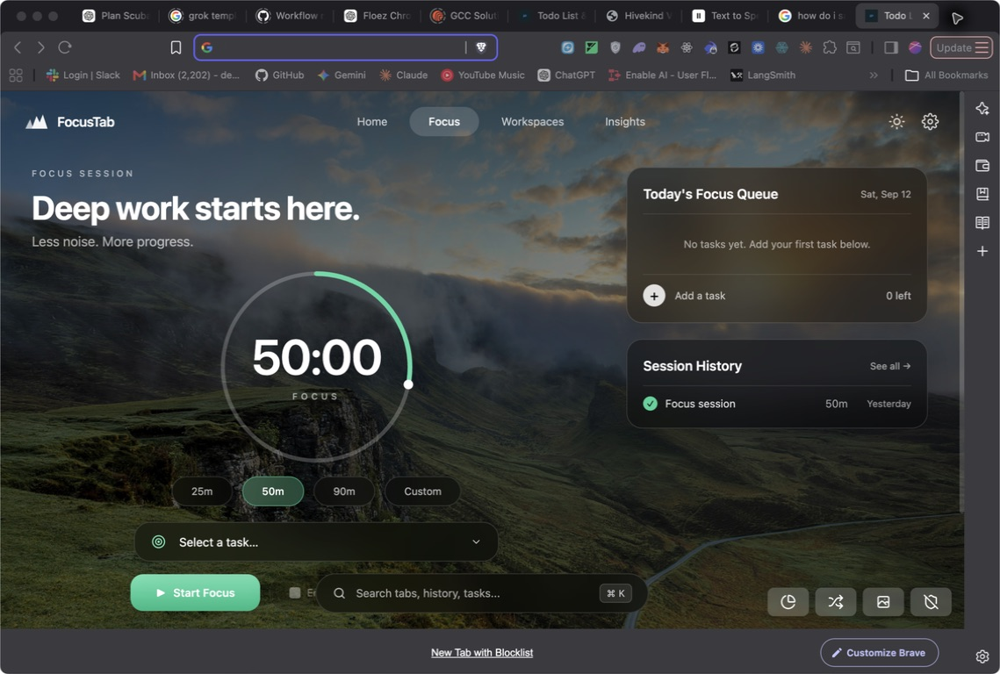
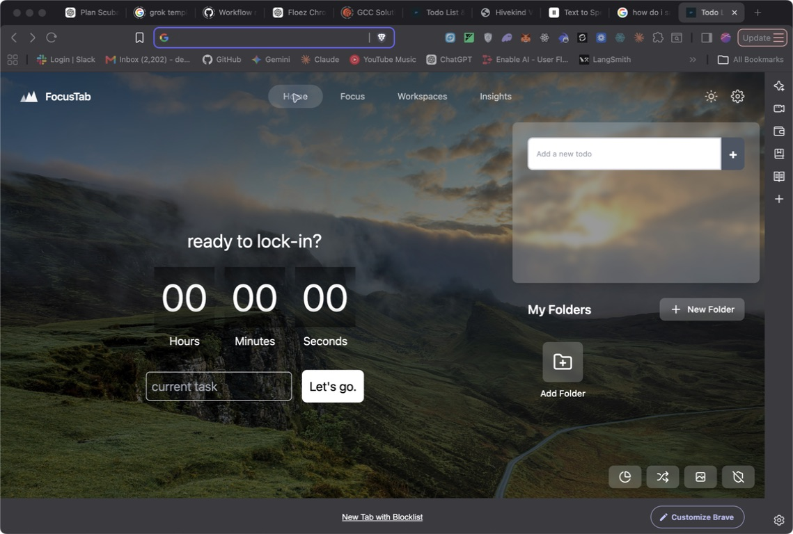
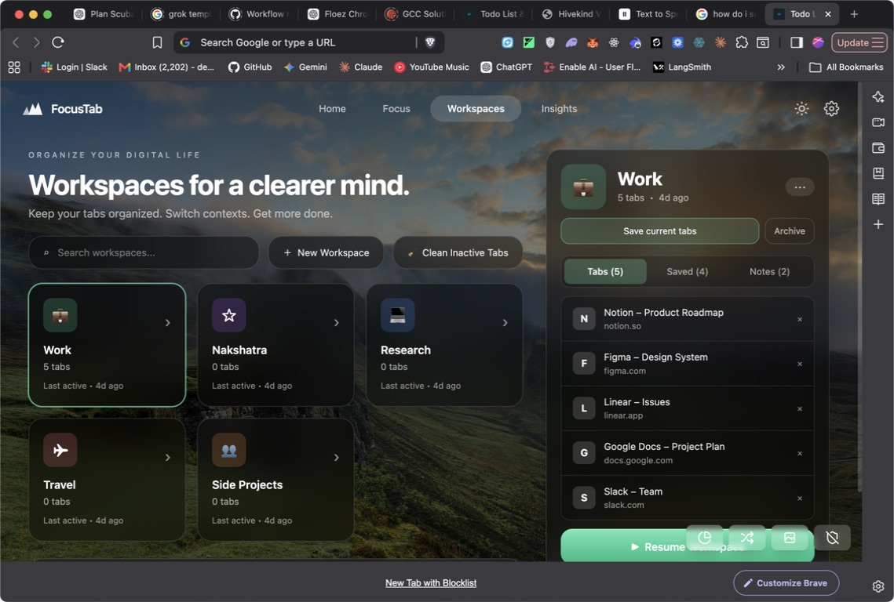
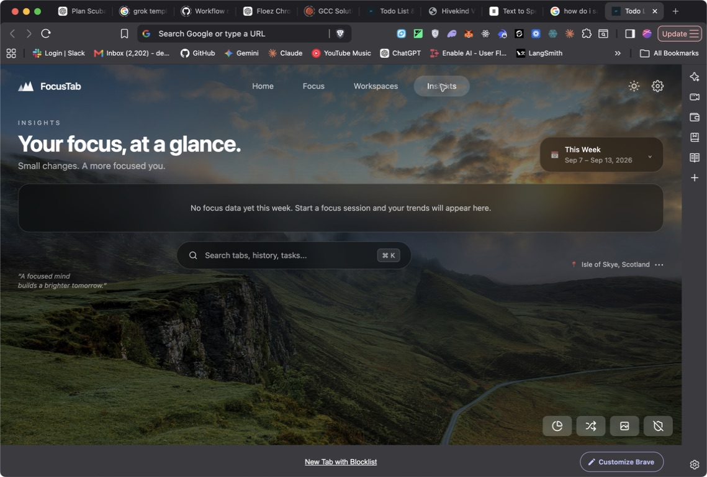
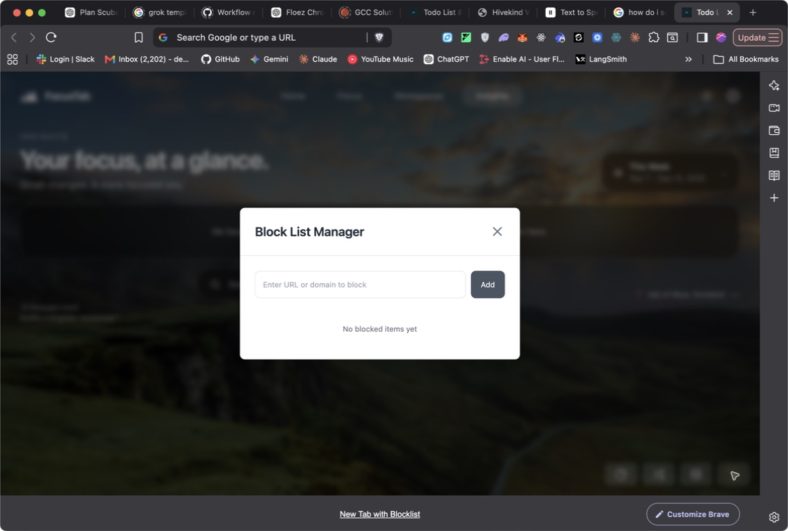
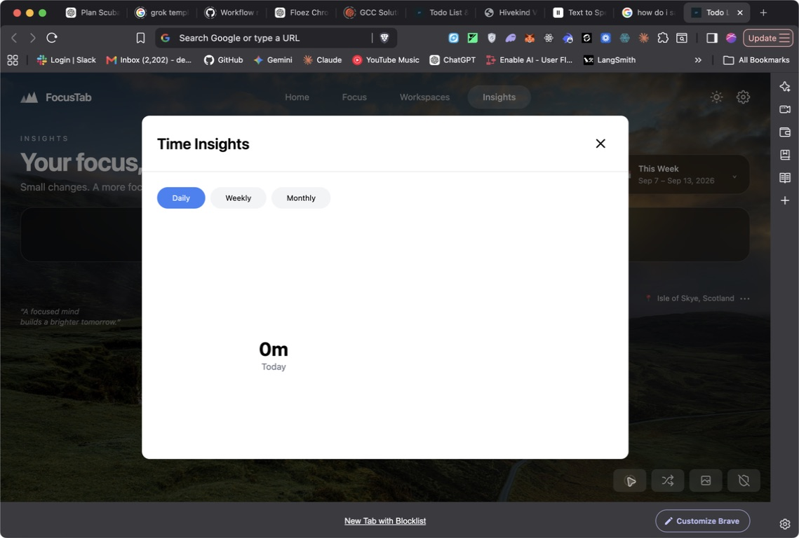
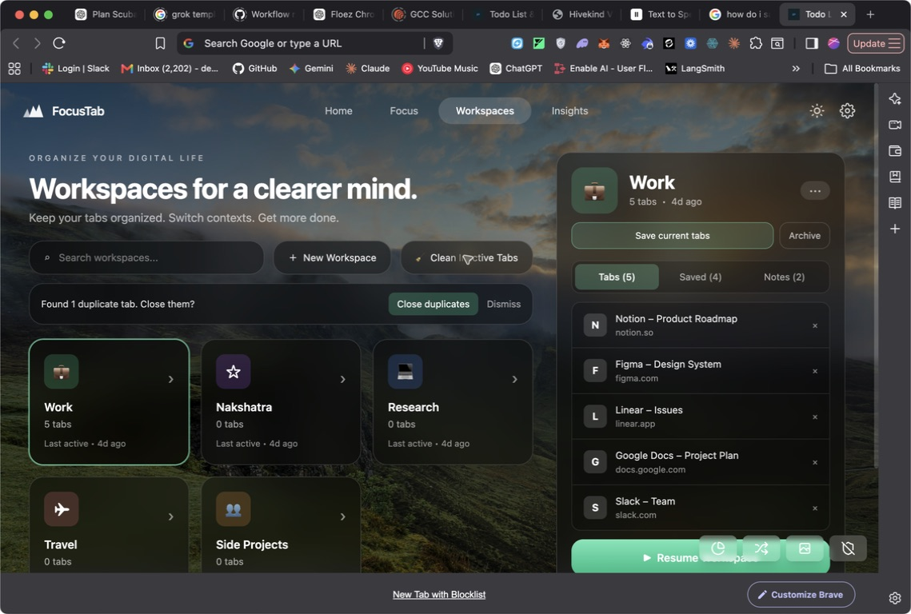

# FocusTab V1 assessment and implementation plan

**Date:** 2026-09-12
**Surface tested:** Brave new-tab extension
**Repository state:** `feature/focus-workspaces-insights-ui`, with current worktree changes
**Product promise assessed:** “Your browser, without the chaos.”

## Executive verdict

The current build is a useful visual and technical prototype, not yet a launchable V1.

- **Visual direction:** 7/10. Focus, Workspaces, and Insights establish a coherent scenic/glass language.
- **Functional V1 coverage:** about 33%. One feature is substantially present, thirteen are partial, and nine are absent.
- **Launch readiness:** 3/10. The extension builds, but fake seeded data, broad eager permissions, a search-page interception bug, missing focus orchestration, placeholder controls, inaccurate analytics, and no automated tests are release blockers.

The strongest existing foundation is the timer + local tasks + workspace tab capture/restore + basic blocking/event pipeline. The largest product gap is that **Start Focus currently starts a timer; it does not manage the browser**. That means the main differentiator and Magic Moment #2 are not implemented yet.

## Audit scope and evidence

This assessment used:

1. A live Brave new-tab walkthrough.
2. Current repository implementation and manifest inspection.
3. A production build (`npm run build`).
4. Official Chrome Extension API documentation for current platform constraints.

The build completed successfully. It emitted a **3.97 MiB** main JavaScript bundle and a **521 KiB** audio file, both above Webpack's performance guidance. The package has no test, lint, or dedicated type-check scripts.

### Captured screens

#### Step 1 — Focus landing screen

**Health: Partial.** Strong visual hierarchy and the correct timer presets are present. The screen shows local tasks, recent sessions, basic stats, and a task-attached timer. Start Focus does not open a workspace, collapse unrelated tabs, or activate a focus-scoped blocklist. “Skip Break” actually abandons the active session, and “See all” has no action.

#### Step 2 — Legacy Home screen

**Health: Poor.** This is a second, older product shell with a different layout and component language. It lacks the promised greeting, clear Start Focus hierarchy, workspace shortcuts, daily snapshot, and universal search. The app currently defaults to Focus instead of Home.

#### Step 3 — Workspaces

**Health: Partial.** Create, search, save current tabs, remove a stored tab, resume, and archive have implementation paths. The visible Work/Nakshatra/Research/Travel data is seeded demo content written into the user's local storage, not a preview state. Saved and Notes counts are shown even though both panels say they will arrive “in a later slice.” Rename, icon choice, archived recovery, close-workspace tabs, and Home recency are absent. The bottom action is visibly covered by Brave's new-tab footer at this viewport.

#### Step 4 — Insights empty state

**Health: Partial.** The empty state is calm and understandable. The aggregation pipeline reads focus sessions, tasks, blocked events, and time entries, but some labels are not truthful: “Context Switching” is implemented as unique domains visited, and distraction time can be estimated as one minute per block event. The week selector, search field, and “See all insights” affordances are non-functional.

#### Step 5 — Website blocklist

**Health: Partial.** Domain add, enable/disable, remove, and navigation redirect exist. The modal is visually disconnected from the current design system and lacks focus-only rules, schedules, temporary blocks, and allowlisting. It stores its configuration in sync storage rather than following the stated local-first rule.

#### Step 6 — Legacy time insights modal

**Health: Poor.** This is a second analytics experience competing with the Insights tab. It duplicates product concepts, uses a different style, and inflates the new-tab bundle through its chart dependency. It should be removed, not expanded.

#### Step 7 — Duplicate scan

**Health: Partial.** The scan correctly found one duplicate and asked before closing it. That preview-before-change pattern is good. The control is labelled “Clean Inactive Tabs,” but the implementation checks exact duplicate URLs only; it does not inspect inactivity or stale age.

## V1 coverage matrix

Legend: **Present**, **Partial**, **Missing**.

| V1 area | Status | What exists now | Launch gap |
| --- | --- | --- | --- |
| New Tab Home | Partial | Scenic background, glass panels, navigation | Home is legacy, defaults to Focus, and lacks greeting, recent workspaces, daily resume/snapshot, and real search |
| Focus Timer | Partial | 25/50/90/custom, persistent timer state, pause/resume, task attachment, alarm, session record | No real break lifecycle; completion/cancel semantics and recovery need hardening |
| Focus Mode | Missing | Timer only | No preflight, workspace open, unrelated-tab collapse, focus-scoped rules, restore, or summary |
| Tasks | Partial | Add, complete, delete, estimated minutes at creation | No Today/Later UI, reorder, edit estimate, workspace assignment, or completed view |
| Website Blocking | Partial | Domain list, enable/disable, redirect, blocked-event count | No focus-only mode, schedules, temporary blocks, allowlist, safe bypass, or precise domain matching |
| Workspaces | Partial | Create, save current tabs, remove stored tab, resume, archive, search | Seeded fake data; no rename, icon editing, unarchive, close, daily recency, or full browser-state restore |
| Tab Management | Partial | Exact-URL duplicate scan and close preview | No open-tab search, stale tabs, recently closed, selection, or bulk cleanup |
| Basic Smart Tabs | Missing | None | No grouping candidates, AI classification, explanations, or approval flow |
| History Search | Missing | None; manifest lacks `history` | No contextual permission request or keyword/domain/time query |
| Bookmarks / Saved | Partial | Custom local bookmarks/folders and context-menu save | No Chrome bookmark import/search, no modern Saved surface, no unified search integration |
| Global Search | Missing | Visual-only pill | No input, overlay, providers, ranking, keyboard navigation, or actions |
| Command Palette | Missing | `⌘K` label only | Shortcut did nothing in live testing; no commands or routing |
| Browser Health | Partial | Duplicate count path and open-tab count | No stale model, inactive age, memory/discard signals, recently closed, or cleanup dashboard |
| Cache / History / Cookies | Missing | None; manifest lacks `browsingData` | No permission request, scope/time controls, consequence copy, progress, or result state |
| Basic Analytics | Partial | Focus sessions, tasks, blocked events, domain time entries, Insights UI | Tracking lifecycle is incomplete; metrics need truthful definitions and one consolidated surface |
| Focus Score | Partial | Simple completion/block-rate formula | Formula is undocumented, ignores task completion/context switching, and can reward short/zero-minute sessions |
| Session History | Partial | Four recent local records | “See all” is inert; no filtering, details, summary, or task/workspace drill-in |
| Daily Resume | Missing | Workspace last-active timestamps exist | No morning card, unfinished-task link, or one-click restore from Home |
| Side Panel | Missing | None; no manifest entry or permission | No contextual current-tab/task/workspace actions |
| Themes | Present | Curated shuffle, persisted background, local file upload, dark overlay | Header Theme button is inert; controls need consolidation and accessible labels |
| Local-first storage | Partial | Tasks, sessions, workspaces, bookmarks, analytics, background use local storage | Blocklist/blocked counts use sync storage; larger event/search data has no versioned database or retention controls |
| Permissions UX | Missing | Permissions are requested eagerly in the manifest | No optional permissions or contextual explanation; `<all_urls>` and search-engine content scripts are broad |
| Optional account | Partial | Core extension does not require sign-in | No entitlement model, privacy/settings surface, or boundary for optional cloud AI |

## What is worth keeping

1. **The scenic/glass design language.** It already supports the “calmer browser” promise.
2. **The timer state model.** Presets, custom duration, pause/resume, alarms, and local session records are a workable foundation.
3. **The local task migration path.** The newer task model can absorb legacy todos without losing user data.
4. **The workspace capture/restore primitives.** Save current tabs and reopen missing URLs are a useful base.
5. **The cleanup confirmation pattern.** The live duplicate result asked before any tabs were closed.
6. **The event ingredients for analytics.** Sessions, blocked events, and activity entries exist, even though their current aggregation is not yet trustworthy.

## Release blockers

### P0 — The primary promise is not implemented

`Start Focus` calls the timer hook only. It does not invoke workspace or tab-management behavior. V1 cannot launch around “browser control” until one recoverable focus-session transaction can:

1. Snapshot current browser state.
2. Open or activate the chosen workspace.
3. Group and collapse unrelated tabs.
4. Apply focus-only block rules.
5. Restore the previous state when the session ends or after a service-worker/browser restart.

### P0 — Demo data is written as user data

When no workspaces exist, the hook imports `mockWorkspaces` and persists it. This is why the live screen showed Work, Nakshatra, Research, Travel, and counts that the user did not create. Empty states must remain empty; sample data can exist only inside an explicit, labelled demo mode.

### P0 — Search-page navigation can be broken

The content script prevents clicks on search-result anchors and sends a `checkUrl` message. The background message handler has no `checkUrl` branch. This can leave clicks intercepted with no valid response. Remove this click interceptor immediately. The main-frame blocker should own blocking; search results do not need a broad injected script in V1.

### P0 — Permissions do not match the privacy promise

The manifest eagerly requests bookmarks, tabs, idle, notifications, webNavigation, scripting, TTS, and `<all_urls>`, while the requested V1 calls for permissions only when relevant. History, browsing-data, sessions, side-panel, and tab-group permissions are absent. Rebuild the manifest around a small core permission set plus contextual optional permissions and optional host access.

Chrome's own guidance recommends optional permissions when the feature permits it, so users understand why access is needed and grant only what they use. The platform supports runtime permission requests, a dedicated side-panel manifest entry, tab-group collapsing, native history search, recently closed sessions, and explicit browsing-data clearing.

### P0 — Visible UI is not truthful

- Global Search is a `
` with text, not an input or button.
- `⌘K` does nothing.
- Settings and the header Theme button do nothing.
- Saved/Notes show seeded counts for placeholder panels.
- “Clean Inactive Tabs” only scans duplicate URLs.
- “Skip Break” abandons the current session.
- “Context Switching” counts unique domains, not switches.
- Distraction time can be invented as one minute per blocked event.

Before launch, every visible control must either work, be removed, or be clearly labelled as unavailable without showing fabricated personal data.

## UX and accessibility findings

### Structural

- **Two competing home experiences:** the old Home and new Focus views duplicate timer/tasks with different design systems. There should be one default Home; Focus becomes an active-session detail view.
- **Two competing analytics experiences:** the modern Insights page and old Time Insights modal should be consolidated.
- **Secondary tools are floating, unlabeled icons:** blocklist, theme upload, shuffle, and analytics are detached from Settings and sometimes overlap Brave's footer.
- **Desktop-only layout:** fixed two-column grids and fixed widths do not reflow at narrower new-tab/popup/side-panel widths.
- **No onboarding or permission explanation:** users are asked to trust broad access before seeing value.

### Accessibility risks visible from the implementation and live UI

- Several icon-only controls expose no accessible name, including modal close/toggle/delete buttons and the floating tool buttons.
- Global Search is not focusable or keyboard-operable.
- Task completion uses a `role="checkbox"` span nested inside a button; the checkbox itself is not a normal keyboard target.
- Modal containers do not declare dialog semantics, `aria-modal`, initial focus, focus trapping, or focus return.
- Status changes such as “Created,” “Closed,” and blocklist notifications are not announced through a live region.
- Placeholder-only labels are used for important text fields.
- White text at 40–60% opacity sits over arbitrary user-selected images, so contrast can vary below a usable level.
- Fixed viewport grids and controls visibly collide with browser UI at the tested size.
- Emoji and text-symbol icons are read inconsistently and should be replaced with the existing icon library plus labels.

Screenshot review cannot confirm screen-reader output, focus order across every flow, reduced-motion behavior, high-contrast mode, or 200% zoom. Those require keyboard and assistive-technology testing after the semantics are fixed.

## Recommended product shape

Keep the top-level product calm:

- **Home:** greeting, task-attached 50-minute focus setup, Today tasks, 3–5 recent workspaces, daily snapshot, Search anything.
- **Workspaces:** create/manage/restore and the guided Organise flow.
- **Insights:** daily/weekly outcomes only; no mock AI insight cards in V1.
- **Active Focus:** shown only during a running session, with timer, current task/workspace, blocked count, pause/end, and restore state.
- **One-click deeper:** Saved, Browser Health, Settings, session history, and cleanup.
- **Side panel:** current task, focus state, Save page, Add to workspace, Block current site.

The existing `Home / Focus / Workspaces / Insights` top navigation can remain during implementation, but Home must become the default and Focus should only feel like a destination when a session is active. A permanent Focus tab plus a full focus setup on Home will otherwise duplicate the same job.

## Technical direction

Do not rewrite the extension framework before V1. Keep React + TypeScript + Manifest V3 + Webpack, but introduce boundaries that make browser behavior testable.

### 1. Browser capability layer

Create a single adapter for tabs, groups, history, bookmarks, sessions, permissions, browsing data, blocking rules, and the side panel. UI components should never call `chrome.*` directly. The adapter should normalize Chrome/Brave internal URLs (`chrome://`, `brave://`, extension pages), errors, and feature availability.

### 2. Typed service-worker commands

The background service worker should own browser-changing operations:

- `focus.start`, `focus.pause`, `focus.end`, `focus.recover`
- `workspace.capture`, `workspace.resume`, `workspace.close`
- `tabs.inventory`, `tabs.closeDuplicates`, `tabs.closeSelected`
- `blocking.apply`, `blocking.clear`, `blocking.allowOnce`
- `history.search`, `bookmarks.search`
- `browsingData.clear`

Each command returns a typed result and an operation ID. Long operations persist progress so reopening the new tab or side panel shows the current state and recovery action.

### 3. Versioned local data

Use IndexedDB for growing records and `chrome.storage.local` for small settings/session pointers.

Suggested stores:

- `tasks`
- `workspaces`
- `workspaceTabs`
- `focusSessions`
- `activityEvents`
- `blockedEvents`
- `savedItems`
- `settings`
- `operations`

Add a one-time migration for current `todos`, `focusTasks`, `focusSessions`, `workspaces`, `bookmarks`, `folders`, `timeEntries`, and `blocklist`. Never seed mocks into a production store.

### 4. Recoverable focus orchestration

Chromium tab groups can be collapsed, which is the safest practical interpretation of “hide unrelated tabs.” On Start Focus:

1. Capture tab IDs, URLs, index, group, pinned state, active tab, and window.
2. Open missing workspace URLs.
3. Group relevant tabs as the active workspace.
4. Group unrelated tabs into a temporary collapsed “Paused” group.
5. Apply session block rules.
6. Persist the restore plan before changing tabs.

On End/Cancel/expiry/restart, restore groups and active state. If exact restoration is impossible because tabs were changed manually, show a clear best-effort recovery summary rather than silently failing.

### 5. Blocking through declarative rules

Replace broad `webNavigation` interception and search-page content scripts with `declarativeNetRequest` dynamic rules for persistent blocks and session rules for focus-only/temporary blocks. Add higher-priority allow rules for allowlisted domains. Use precise host normalization; the current “last two hostname segments” approach will over-match public-suffix domains such as `co.uk`.

### 6. One global search engine

The same overlay should power Search and Command modes. Query providers in parallel:

- Open tabs
- Recently closed sessions
- Native browser history
- Chrome/Brave bookmarks
- FocusTab saved items
- Tasks
- Workspaces

Default ranking: exact title/domain match, starts-with, token match, recency, frequency. V1 does not need embeddings. `Cmd/Ctrl + K` opens it on extension pages; the toolbar/side panel provides access from ordinary pages.

### 7. Truthful analytics

Use append-only local events with local-time day boundaries. Define metrics before rendering them:

- Focus time = actual unpaused session duration.
- Sessions completed = sessions reaching explicit completion or timer expiry.
- Tasks done = tasks whose `completedAt` falls in the period.
- Distractions blocked = actual matched block events.
- Distraction time = measured foreground time on user-labelled distracting domains; do not infer minutes from block attempts.
- Context switches = sequential workspace/domain transitions, not number of distinct domains.
- Focus score = published, stable weighted formula with a “not enough data” state.

### 8. Optional permissions

Suggested baseline install permissions: `storage`, `alarms`, `activeTab`, and only the browser-control permissions required for core Workspaces/Focus after store-warning review.

Request contextually:

- `history` when the user first selects History in Search.
- `bookmarks` when they choose Import/Search browser bookmarks.
- `sessions` when they open Recently Closed.
- `browsingData` when they open cleanup controls.
- `notifications` when they enable timer notifications.
- host access when they enable site blocking.

The Side Panel API requires its manifest entry and `sidePanel` permission. It is available in Chromium-based Chrome 114+; verify the minimum Brave version during QA.

## Six-week delivery plan

This is credible in six weeks with **two engineering lanes plus regular design/QA**. For one engineer, plan **eight to ten weeks** rather than shipping unverified browser-control behavior.

### Week 1 — Foundation and truthful Home

**Outcome:** one coherent product shell with real empty states.

- Remove persisted mock workspace data and mock AI insights from production paths.
- Make Home the default new-tab state and rebuild it from the new glass components.
- Consolidate the old timer/todo/Home code into the newer task and focus hooks.
- Remove the old analytics modal and search-page click interceptor.
- Add browser adapter, typed messages, versioned local database, and migrations.
- Rework manifest branding to FocusTab and define baseline/optional permissions.
- Add Settings shell with privacy, permissions, data export/delete, theme, and notification choices.

**Acceptance gate:** a fresh profile opens a calm, truthful Home with no demo data and no inert controls.

### Week 2 — Workspaces and browser inventory

**Outcome:** Magic Moment #3 works without losing browser state.

- Capture current tabs with normalized URLs, favicon URL, pinned/group/window metadata.
- Create, rename, choose icon, archive/unarchive, and delete/close with confirmation.
- Resume only missing tabs, focus the workspace, and persist last-used time.
- Implement open-tab search, exact/canonical duplicate detection, stale threshold, selection, and recently closed.
- Rename “Clean Inactive Tabs” to the exact action until stale cleanup is implemented.
- Add recovery after partial open/close failures.

**Acceptance gate:** a workspace can be saved, closed, and restored twice in Chrome and Brave with no duplicates or internal browser URLs.

### Week 3 — Focus Mode and blocking

**Outcome:** Magic Moment #2 works end to end.

- Add task + workspace + duration + block profile preflight.
- Persist a restore plan, open the workspace, collapse unrelated tabs, and start the timer as one recoverable operation.
- Implement focus-only/persistent/temporary/scheduled block rules and allowlist priority.
- Add proper break states and replace the misleading “Skip Break” action.
- Build session completion summary and Restore tabs action.
- Recover an interrupted session after browser/service-worker restart.

**Acceptance gate:** Start Focus shows exactly what will open, collapse, and block; End Focus restores browser state and produces a truthful summary.

### Week 4 — Unified search, command palette, bookmarks, and Saved

**Outcome:** Magic Moment #4 works.

- Build the real search input/overlay with grouped, keyboard-navigable results.
- Add tabs, history, bookmarks, saved items, tasks, workspaces, and recently closed providers.
- Request history/bookmark/session permissions only when their provider is used.
- Add command actions: open workspace, switch tab, create task, start focus, block domain, scan duplicates.
- Add Save current page and one-time Chrome/Brave bookmark import.
- Add Saved collections with local search; keep tagging manual in V1.

**Acceptance gate:** `Cmd/Ctrl + K`, `stripe webhook`, and arrow/Enter navigation can reach every promised source without requiring an account.

### Week 5 — Daily Resume, side panel, browser health, and analytics

**Outcome:** the product supports returning to work and lightweight daily control.

- Add Home resume card using last workspace + unfinished associated task.
- Add the responsive side panel with current task/focus state and current-page actions.
- Build Browser Health with transparent definitions for duplicates, stale tabs, and recently closed.
- Add explicit cache/history/cookie cleanup with time range, affected data, warnings, progress, and completion result.
- Fix activity tracking around window focus, idle, browser shutdown, and local timezone.
- Consolidate daily/weekly analytics and publish the V1 score formula.

**Acceptance gate:** Magic Moment #3 is available on the next day's first new tab, and every destructive cleanup action has a preview and confirmation.

### Week 6 — Basic Smart Tabs and launch hardening

**Outcome:** Magic Moment #1 plus store-ready quality.

- Generate local candidate clusters from domain, normalized title tokens, opener/group proximity, and recency.
- Optionally batch candidates through cloud AI for paid users to improve labels/classification; never send full history or page content by default.
- Show duplicates, stale tabs, candidate workspaces, and Unclassified before making changes.
- Require user approval for create/move/close actions and learn only from explicit corrections.
- Add onboarding, permission education, privacy copy, first-run success path, and optional entitlement boundary.
- Add keyboard, screen-reader, 200% zoom, reduced-motion, Chrome/Brave, service-worker restart, and slow-profile QA.
- Remove unused dependencies and split routes so Home does not load chart code.

**Acceptance gate:** a 50-tab fixture produces a truthful, reviewable Organise proposal; approving it never closes or moves an unselected tab.

## Engineering lanes and dependencies

### Lane A — Product UI and local data

- Home, tasks, workspaces, Insights, Settings, Saved, Search, command palette.
- IndexedDB schema and migrations.
- Responsive/accessibility system and empty/loading/error states.

### Lane B — Browser control and service worker

- Tabs/groups/windows/sessions adapters.
- Focus transaction and restore plan.
- DNR blocking rules and permission handling.
- Activity events, cleanup operations, side-panel coordination.

The lanes join through typed background commands and shared data types. Do not let screens call raw browser APIs independently; that is the current source of duplicated lifecycle logic and hard-to-test behavior.

## Test strategy

### Unit

- URL canonicalization and public-suffix-safe domain matching.
- Duplicate and stale classification.
- Focus lifecycle reducer, pause/break math, expiry, and restart recovery.
- Local-time day/week boundaries, DST, and score calculation.
- Search normalization, ranking, and result grouping.
- Data migrations from every existing storage key.

### Integration

- Typed UI ↔ service-worker messages and failure responses.
- Workspace save/resume/close with partially missing tabs.
- Focus start/end with manually closed or moved tabs.
- Permission denied/revoked states for every optional provider.
- DNR persistent/session rule precedence and allowlist.
- Browsing-data progress and completion callbacks.

### Browser acceptance

- Fresh and upgraded profiles in stable Chrome and Brave.
- 0, 10, 50, and 200-tab fixtures.
- Browser restart and service-worker suspension during an active session.
- Keyboard-only flow from new tab to focus start/end.
- 200% zoom and narrower window/side-panel widths.
- No fake personal data, no silent browser changes, and no irreversible action without explicit confirmation.

## Definition of V1 launch-ready

V1 is ready only when all four magic moments work in a fresh and upgraded profile:

1. **Organise:** inventory shows accurate counts; suggestions are previewed; only approved changes occur.
2. **Start Focus:** workspace opens, unrelated tabs collapse, rules apply, timer runs, and state can be restored.
3. **Resume:** next-day Home offers the last workspace plus unfinished task and restores it once.
4. **Search:** one query returns actionable results from tabs, history, bookmarks, Saved, tasks, and workspaces.

Additional gates:

- Home is interactive in under 1 second on a normal warm profile and under 2 seconds cold.
- No production mock data or dead controls.
- Permissions are explained and requested at the point of use.
- All browser-changing actions have progress, error, and recovery states.
- Core flows pass automated tests plus manual Chrome/Brave acceptance.
- Privacy policy accurately describes local data, optional cloud AI, retention, export, and deletion.

## Explicit V1 non-goals

Keep Calendar, Notion, GitHub, Linear, Todoist, Slack, AI chat, semantic browser memory, complex automations, team workspaces, cross-device history, meeting agents, and a knowledge graph out of V1.

The only cloud AI allowed in this plan is a bounded, optional, batched label/classification assist for Smart Tabs. The full product must remain useful without signing in.

## Platform references

- Chrome permission model and optional permissions: <https://developer.chrome.com/docs/extensions/develop/concepts/declare-permissions>
- Runtime permission requests: <https://developer.chrome.com/docs/extensions/reference/api/permissions>
- Tab Groups API: <https://developer.chrome.com/docs/extensions/reference/api/tabGroups>
- Side Panel API: <https://developer.chrome.com/docs/extensions/reference/api/sidePanel>
- History API: <https://developer.chrome.com/docs/extensions/reference/api/history>
- Sessions API: <https://developer.chrome.com/docs/extensions/reference/api/sessions>
- Browsing Data API: <https://developer.chrome.com/docs/extensions/reference/api/browsingData>
- Declarative Net Request API: <https://developer.chrome.com/docs/extensions/reference/api/declarativeNetRequest>
